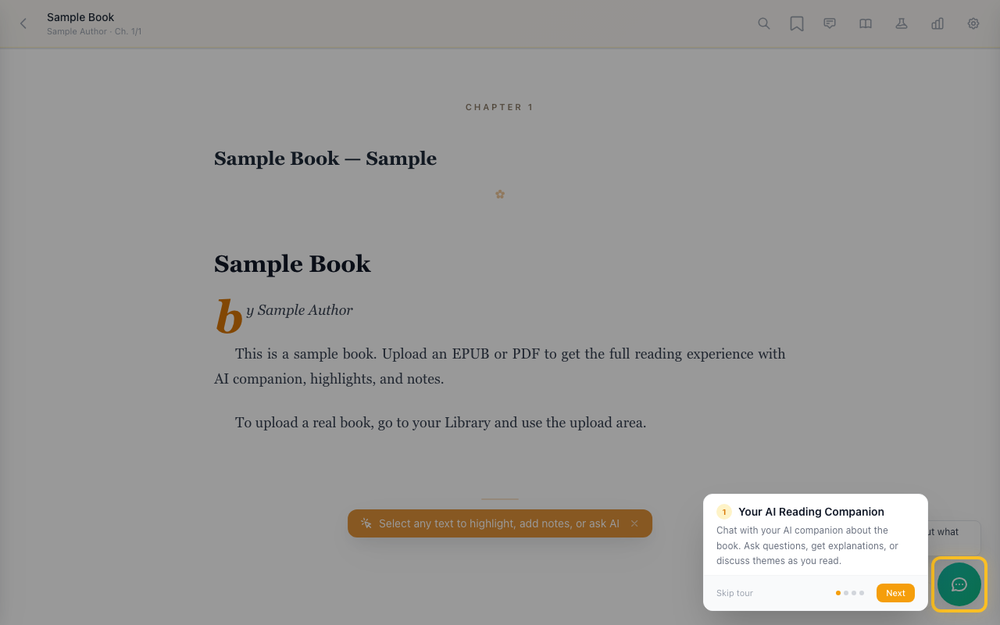
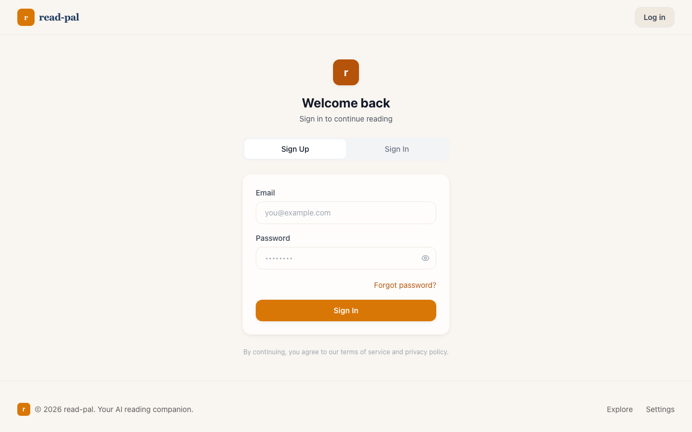
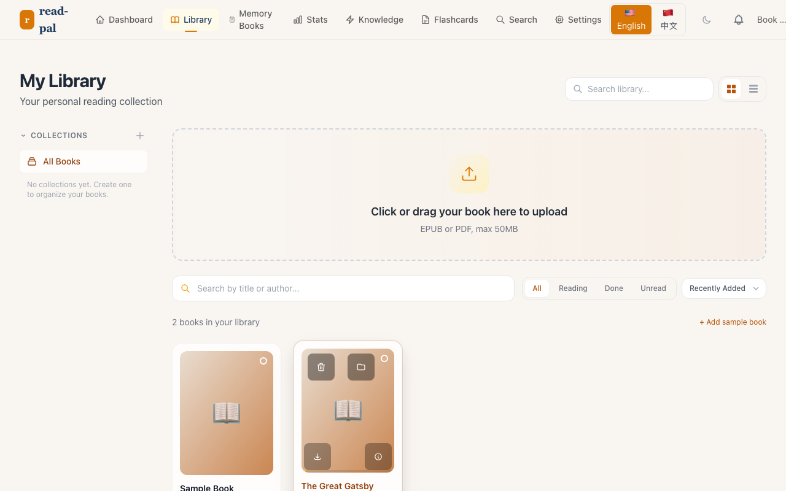

<div align="center">

# read-pal

**A friend who reads with you.**

Your AI reading companion — ask questions, explore ideas, and remember every insight.

[](https://github.com/pengdd1998/read-pal/actions)
[](packages/server/tests)
[](packages/server)
[](packages/web)
[](LICENSE)
[](https://github.com/pengdd1998/read-pal)
[]()

[Live Demo](http://175.178.66.207:8090) · [Get Started](#quickstart) · [Features](#features) · [Architecture](#architecture) · [Deploy](#deployment) · [Contributing](CONTRIBUTING.md)

</div>

---

## What is read-pal?

read-pal transforms passive reading into an active, intelligent experience. Upload any EPUB book and read alongside an AI companion who:

- **Explains** tricky passages in context
- **Asks** thoughtful questions to deepen understanding
- **Connects** ideas across all the books you've read
- **Remembers** everything so you don't have to

Think of it as a friend who's always read the same book and loves talking about it.

## Screenshots

<table>
  <tr>
    <td align="center"><b>AI Companion Chat</b></td>
    <td align="center"><b>EPUB Reader</b></td>
  </tr>
  <tr>
    <td></td>
    <td></td>
  </tr>
  <tr>
    <td align="center"><b>Knowledge Graph</b></td>
    <td align="center"><b>Library</b></td>
  </tr>
  <tr>
    <td></td>
    <td></td>
  </tr>
</table>

> Try the [live demo](http://175.178.66.207:8090) to see the full experience.

## Features

### AI Reading Companion
Chat with your book in real-time. Highlight a passage, ask "why does this matter?", and get an instant, contextual answer. Your companion remembers your reading history and connects ideas across your entire library.

### 5 Reading Friend Personas
Choose a companion that matches your style:
- **Sage** 🧙 — Wise & patient, asks deep questions
- **Penny** 🌟 — Enthusiastic explorer of ideas
- **Alex** ⚡ — Gentle challenger, pushes your thinking
- **Quinn** 🌙 — Quiet companion, speaks when needed
- **Sam** 📚 — Study buddy, practical & focused

### Personal Knowledge Graph
Ideas connect automatically across books. See how concepts relate in a visual, interactive graph that grows with every page you read.

### Smart Annotations
Highlights, notes, and bookmarks with AI-powered connections. Your annotations feed into the knowledge graph and AI conversations.

### Spaced Repetition Flashcards
SM-2 algorithm (Anki-style) generates flashcards from your reading. Review at optimal intervals to retain what you've learned.

### Memory Books
Beautiful 6-chapter compilations of your reading journey — highlights, notes, AI conversations, and insights woven into a personal document.

### Reading Streaks & Stats
Track your daily reading habit with streaks, activity heatmaps, reading speed analytics, and time tracking.

### Book Clubs & Sharing
Join or create book clubs, share reading cards, export highlights in APA/MLA/Chicago/Zotero formats.

### Developer-Friendly
Full REST API with OpenAPI spec, API key management, webhook support, and CSV/Markdown/JSON export.

## Architecture

```
read-pal/
├── packages/
│   ├── server/         # Python 3.12 / FastAPI backend
│   │   ├── app/
│   │   │   ├── routers/       # 19 routers, 130+ endpoints
│   │   │   ├── services/      # Business logic (LLM, knowledge, synthesis)
│   │   │   ├── models/        # SQLAlchemy 2.0 ORM (27 models)
│   │   │   ├── schemas/       # Pydantic request/response
│   │   │   └── middleware/    # Auth, rate limiting
│   │   ├── alembic/           # Database migrations
│   │   └── tests/             # 325 pytest tests
│   └── web/           # Next.js 14 / TypeScript frontend
│       └── src/
│           ├── app/           # 30+ pages (App Router)
│           ├── components/    # 50+ React components
│           └── hooks/         # 10 custom hooks
└── docs/
```

### Tech Stack

| Layer | Technology |
|-------|-----------|
| Backend | Python 3.12, FastAPI, SQLAlchemy 2.0 (async) |
| AI Engine | GLM (Zhipu AI) via LangChain, OpenAI-compatible API |
| Frontend | Next.js 14, TypeScript, TailwindCSS |
| Database | PostgreSQL 16, Redis 7 |
| Search | Vector-ready (Pinecone configured) |
| File Processing | ebooklib (EPUB), pypdf (PDF) |
| Knowledge | NetworkX graph engine |
| Testing | pytest (325 tests), Vitest (24 tests) |

## Quickstart

### Docker (fastest)

```bash
git clone https://github.com/pengdd1998/read-pal.git
cd read-pal
cp .env.example .env   # edit with your DB credentials + GLM API key
docker compose up -d
```

Open http://localhost:8090 — that's it.

### Prerequisites

- Python 3.12+
- Node.js 20+
- PostgreSQL 16
- Redis 7
- pnpm

### 1. Clone & Install

```bash
git clone https://github.com/pengdd1998/read-pal.git
cd read-pal

# Backend
cd packages/server
uv sync

# Frontend
cd ../../
pnpm install
```

### 2. Configure Environment

```bash
cp packages/server/.env.example packages/server/.env
```

Edit `.env` with your database, Redis, and AI API credentials.

### 3. Database Setup

```bash
cd packages/server
alembic upgrade head
```

### 4. Run Development Servers

```bash
# Backend (port 8000)
cd packages/server
uvicorn app.main:app --reload --port 8000

# Frontend (port 3000)
pnpm --filter @read-pal/web dev
```

Open http://localhost:3000 and start reading!

### 5. Run Tests

```bash
# Backend (325 tests)
cd packages/server
uv run pytest tests/ -v

# Frontend
pnpm --filter @read-pal/web test
```

## API Overview

read-pal exposes a comprehensive REST API under `/api/v1/`:

| Category | Endpoints | Description |
|----------|-----------|-------------|
| Auth | 8 | Register, login, password reset, token refresh |
| Books | 8 | CRUD, upload (EPUB/PDF), tags, stats |
| Reading | 7 | Sessions, stats, heartbeat, speed tracking |
| Annotations | 7 | Highlights, notes, bookmarks, search, tags |
| AI Companion | 7 | Chat, stream (SSE), summarize, explain, questions |
| AI Friend | 2 | 5 persona chat, relationship tracking |
| Knowledge | 5 | Graph, themes, concepts, search |
| Synthesis | 2 | Single-book & cross-book analysis |
| Flashcards | 6 | SM-2 spaced repetition, decks |
| Book Clubs | 7 | CRUD, join/leave, discussions, progress |
| Collections | 6 | CRUD, add/remove books |
| Export | 7 | CSV, Markdown, HTML, Zotero, APA, MLA, Chicago |
| Stats | 3 | Dashboard, calendar, reading speed |
| Share | 6 | Create, reading cards, export |
| Webhooks | 5 | Events, delivery logs, test |
| Settings | 3 | User preferences, reading goals |
| API Keys | 4 | CRUD for personal access tokens |
| Notifications | 4 | List, mark read, unread count |

Full OpenAPI spec available at `/docs` when running the server.

## Deployment

### Docker Compose (Recommended)

```bash
docker compose up -d
```

### Manual Deployment

```bash
# Backend
cd packages/server
uv sync --production
alembic upgrade head
uvicorn app.main:app --host 0.0.0.0 --port 8000

# Frontend
cd packages/web
NEXT_PUBLIC_API_URL=https://your-api-url pnpm build
pnpm start
```

## Why Open Source?

Your reading data is personal — highlights, notes, AI conversations. You should own it. read-pal is MIT licensed: self-host, export your data, no lock-in.

## Contributing

We welcome contributions! See [CONTRIBUTING.md](CONTRIBUTING.md) for guidelines.

Areas where we'd love help:
- Mobile responsiveness improvements
- Browser extension (Chrome/Firefox)
- E-reader integrations (Kindle, Kobo)
- Email service integration (SMTP)
- Accessibility audit and fixes

## Roadmap

### Phase 1 — MVP (Current)
- [x] EPUB/PDF reading with AI companion
- [x] Annotations and knowledge graph
- [x] Spaced repetition flashcards
- [x] Memory books
- [x] Book clubs and sharing
- [x] Internationalization (English + Chinese)
- [ ] 100 beta users
- [ ] Mobile app (Capacitor)

### Phase 2 — Multi-Agent
- [ ] Research agent (web search, cross-document)
- [ ] Coach agent (comprehension monitoring)
- [ ] Synthesis agent (advanced cross-document)
- [ ] Mobile apps (iOS/Android)

### Phase 3 — Scale
- [ ] Reading Persona system
- [ ] Browser extension
- [ ] Public launch

## License

[MIT](LICENSE) — free for personal and commercial use.
